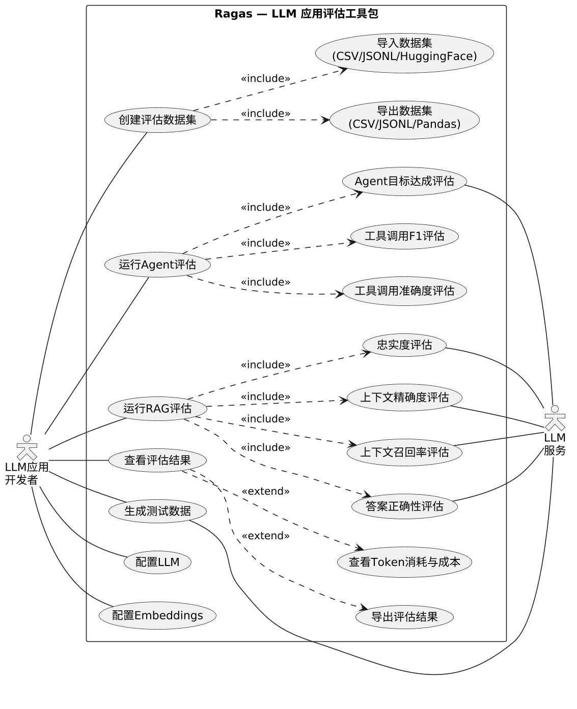
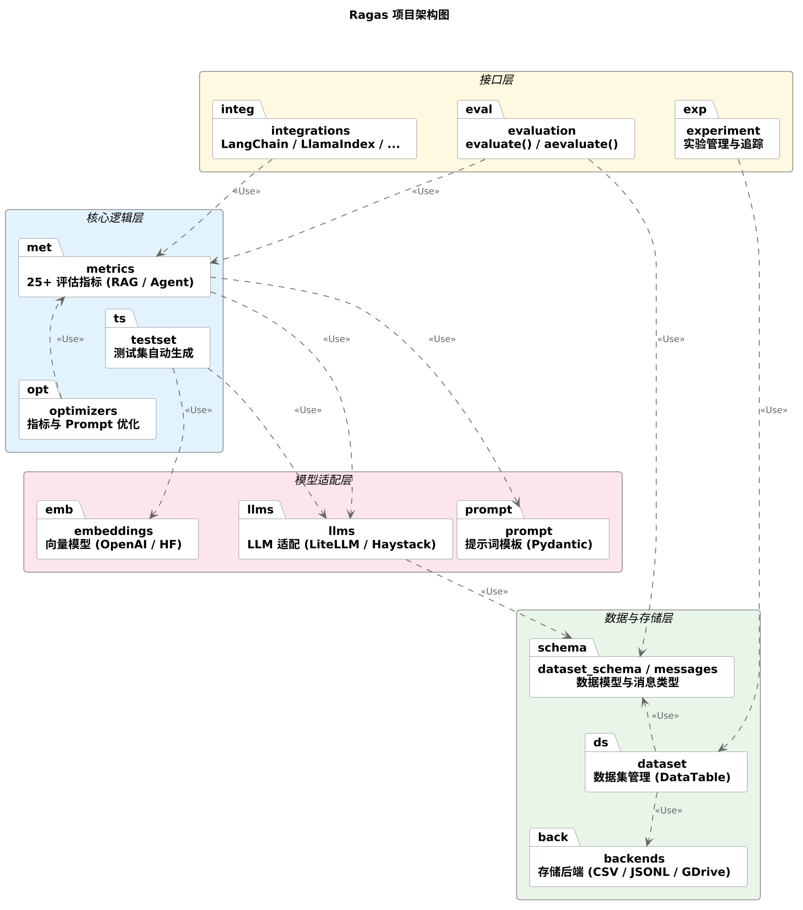
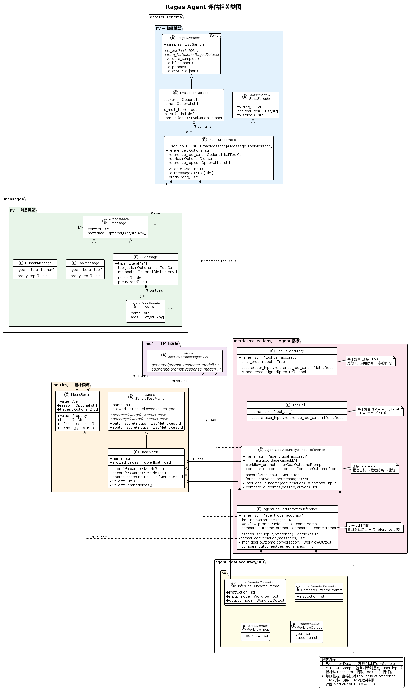

# Ragas 项目代码阅读报告

## 1. Ragas 功能描述

### 1.1 项目简介

Ragas（**RAG** **As**sessment）是一个用于评估大语言模型（LLM）应用的开源工具包，由 Exploding Gradients 团队开发和维护。该项目为 LLM 应用提供客观的量化评估指标，支持对 **Agent 系统**、**RAG（检索增强生成）系统**以及简单的 LLM 任务进行多维度评估。Ragas 同时提供测试数据自动生成能力以及与 LangChain、LlamaIndex 等主流 LLM 框架的集成支持。

### 1.2 用例图



如图所示，Ragas 面向两类参与者：**LLM 应用开发者**（主要用户）和**LLM 服务**（外部系统）。开发者可以执行以下核心功能：

### 1.3 核心功能概览

**功能 1：评估数据集管理**

开发者可以创建和管理评估数据集，支持从 CSV、JSONL、HuggingFace Datasets 等多种格式导入数据，也可以将数据集导出为 CSV、JSONL、Pandas DataFrame 等格式。评估数据集包含单轮（`SingleTurnSample`）和多轮（`MultiTurnSample`）两种样本类型，前者用于 RAG 评估场景，后者用于 Agent 评估场景。

**功能 2：Agent 评估**

针对 Agent 系统的运行轨迹，Ragas 提供以下评估指标：
- **工具调用准确度（Tool Call Accuracy）**：评估 Agent 是否按正确的顺序调用了正确的工具并传递了正确的参数。
- **工具调用 F1（Tool Call F1）**：基于集合匹配的精确率/召回率 F1 分数，不考虑顺序。
- **Agent 目标准确度（Agent Goal Accuracy）**：评估 Agent 最终是否达成了用户的目标意图，分为有参考答案和无参考答案两种模式。
- **主题一致性（Topic Adherence）**：评估 Agent 是否在预定义的主题域内进行回答，防止话题偏离。

**功能 3：RAG 评估**

针对检索增强生成系统，Ragas 提供以下代表性指标：
- **忠实度（Faithfulness）**：回答是否忠实于检索到的上下文。
- **上下文精确度（Context Precision）**：检索到的上下文中有多少是与问题相关的。
- **上下文召回率（Context Recall）**：回答所需的信息有多少被检索到。
- **回答正确性（Answer Correctness）**：回答与标准答案的吻合程度。

**功能 4：评估结果查看与导出**

评估完成后，开发者可以查看每个样本在各指标上的得分、查看汇总统计信息、导出结果为 Pandas DataFrame，以及查看本次评估的 Token 消耗和成本。

**功能 5：测试数据自动生成**

Ragas 的 `testset` 模块能够从文档中自动生成评估用的测试数据，支持单跳和多跳问答场景的合成。

**功能 6：LLM 与 Embeddings 配置**

开发者可以灵活配置底层使用的 LLM 和 Embedding 模型，支持 OpenAI、Google、Anthropic 等多种提供商，通过 `llm_factory()` 工厂函数统一创建。

---

## 2. Ragas 软件架构及各个包和类的作用

### 2.1 Ragas 软件架构总览

Ragas 项目采用**分层架构**设计，自上而下分为四层，各层职责明确、依赖关系清晰：



| 层级 | 名称 | 包含模块 | 职责 |
|:---:|:---:|:---:|:---|
| 第一层 | 接口层 | `evaluation`、`experiment`、`integrations` | 提供对外 API 入口（`evaluate()`/`aevaluate()`）、实验管理、第三方框架集成 |
| 第二层 | 核心逻辑层 | `metrics`、`testset`、`optimizers` | 25+ 评估指标的实现、测试集自动生成、指标与 Prompt 优化 |
| 第三层 | 模型适配层 | `llms`、`embeddings`、`prompt` | LLM 适配器（支持多种提供商）、向量模型封装、Prompt 模板管理 |
| 第四层 | 数据与存储层 | `dataset_schema`、`messages`、`dataset`、`backends` | 数据模型定义、消息类型、数据集管理、多种存储后端（CSV/JSONL/GDrive） |

**核心设计原则**：
1. **分层解耦**：上层依赖下层，同层模块之间尽量减少耦合。例如指标实现依赖 LLM 抽象，但不直接依赖某个特定的 LLM 提供商。
2. **策略模式**：指标体系通过抽象基类定义统一接口，不同指标作为具体策略实现，可以灵活组合使用。
3. **适配器模式**：LLM 层通过 `LangchainLLMWrapper`、`InstructorLLM` 等适配器统一了不同 LLM 框架的接口。
4. **双轨并行**：项目中存在遗留（Legacy）和现代（Collections）两套指标体系，前者基于 `@dataclass` + `PydanticPrompt`，后者基于 `BaseMetric` + `InstructorLLM`，两者共用数据层。

### 2.2 各个包和类的作用

以下重点介绍与 **Agent 评估**直接相关的包和类。

#### 2.2.1 主要软件包简介

| 包 | 路径 | 作用 |
|:---|:---|:---|
| `messages` | `src/ragas/messages.py` | 定义对话消息类型（HumanMessage、AIMessage、ToolMessage、ToolCall），是 Agent 评估数据的基本单元 |
| `dataset_schema` | `src/ragas/dataset_schema.py` | 定义评估样本（SingleTurnSample、MultiTurnSample）和数据集（EvaluationDataset）的数据模型 |
| `metrics` | `src/ragas/metrics/` | 指标框架的核心，包含基类定义、各类指标实现以及结果封装 |
| `metrics/collections` | `src/ragas/metrics/collections/` | 现代指标实现，每个指标独立为一个子包，包含 `metric.py` 和 `util.py` |
| `llms` | `src/ragas/llms/` | LLM 抽象层，定义了 `BaseRagasLLM` 和 `InstructorBaseRagasLLM` 两套接口及其实现 |
| `prompt` | `src/ragas/prompt/` | Prompt 模板系统，包含 `PydanticPrompt`（结构化输出）和 `StringPrompt`（自由文本） |
| `evaluation` | `src/ragas/evaluation.py` | 评估执行入口，编排指标初始化、并行执行和结果汇总 |
| `embeddings` | `src/ragas/embeddings/` | Embedding 模型抽象，支持 OpenAI、HuggingFace 等 |
| `backends` | `src/ragas/backends/` | 数据集存储后端，支持内存、CSV、JSONL、Google Drive |

#### 2.2.2 包与类功能概览

下表列出与 Agent 评估直接相关的类：

| 包 | 子包 | 类 | 主要作用 |
|:---|:---|:---|:---|
| `messages` | — | `Message` | 消息基类，包含 `content` 和 `metadata` 字段 |
| `messages` | — | `HumanMessage` | 人类消息，`type="human"` |
| `messages` | — | `AIMessage` | AI 消息，`type="ai"`，包含可选的 `tool_calls` 列表 |
| `messages` | — | `ToolMessage` | 工具返回消息，`type="tool"` |
| `messages` | — | `ToolCall` | 工具调用描述，包含 `name`（工具名）和 `args`（参数字典） |
| `dataset_schema` | — | `BaseSample` | 评估样本抽象基类 |
| `dataset_schema` | — | `MultiTurnSample` | 多轮对话样本，`user_input` 为消息列表，包含 `reference`、`reference_tool_calls`、`reference_topics` |
| `dataset_schema` | — | `EvaluationDataset` | 评估数据集容器，支持多种序列化格式 |
| `dataset_schema` | — | `EvaluationResult` | 评估结果，包含各样本得分、Token 消耗和成本统计 |
| `metrics` | `base` | `Metric` | 指标抽象根类（遗留），定义 `name` 和 `_required_columns` |
| `metrics` | `base` | `MetricWithLLM` | 需要 LLM 的指标基类（遗留），混入 `PromptMixin` |
| `metrics` | `base` | `MultiTurnMetric` | 多轮指标基类（遗留），定义 `_multi_turn_ascore()` 模板方法 |
| `metrics` | `base` | `SimpleBaseMetric` | 现代指标抽象基类，定义 `score()`/`ascore()` 接口 |
| `metrics/collections` | `base` | `BaseMetric` | 现代指标基类，继承 `SimpleBaseMetric`，校验 LLM/Embeddings 类型 |
| `metrics` | `result` | `MetricResult` | 指标结果封装，支持算术运算和序列化，包含 `value`、`reason`、`traces` |
| `metrics` | `_tool_call_accuracy` | `ToolCallAccuracy` | 工具调用准确度（遗留实现），基于序列比对和参数匹配 |
| `metrics` | `_tool_call_f1` | `ToolCallF1` | 工具调用 F1（遗留实现），基于集合运算 |
| `metrics` | `_goal_accuracy` | `AgentGoalAccuracyWithReference` | Agent 目标准确度-有参考（遗留实现），LLM 推理 |
| `metrics` | `_goal_accuracy` | `AgentGoalAccuracyWithoutReference` | Agent 目标准确度-无参考（遗留实现），LLM 推理 |
| `metrics` | `_topic_adherence` | `TopicAdherenceScore` | 主题一致性（遗留实现），LLM 多步推理 |
| `metrics/collections` | `tool_call_accuracy` | `ToolCallAccuracy` | 工具调用准确度（现代实现） |
| `metrics/collections` | `tool_call_f1` | `ToolCallF1` | 工具调用 F1（现代实现） |
| `metrics/collections` | `agent_goal_accuracy` | `AgentGoalAccuracyWithReference` | Agent 目标准确度-有参考（现代实现） |
| `metrics/collections` | `agent_goal_accuracy` | `AgentGoalAccuracyWithoutReference` | Agent 目标准确度-无参考（现代实现） |
| `metrics/collections` | `topic_adherence` | `TopicAdherence` | 主题一致性（现代实现） |
| `llms` | `base` | `BaseRagasLLM` | LLM 抽象基类（遗留），定义文本生成接口 |
| `llms` | `base` | `InstructorBaseRagasLLM` | LLM 抽象基类（现代），定义结构化输出接口 |
| `llms` | `base` | `InstructorLLM` | 基于 instructor 库的 LLM 实现，支持多种提供商 |
| `prompt` | `base` | `BasePrompt` | Prompt 抽象基类，定义 `generate()` 接口 |
| `prompt` | `pydantic_prompt` | `PydanticPrompt` | 结构化 Prompt，支持类型安全的输入输出和 few-shot 示例 |
| `evaluation` | — | `evaluate()` / `aevaluate()` | 评估执行入口，编排整个评估流程 |

#### 2.2.3 Agent 评估相关类图

下图展示了 Agent 评估相关的类的继承关系与组合关系：



#### 2.2.4 调用关系与评估流程

基于以上类图，Agent 评估的典型执行流程如下：

**第 1 步：加载数据集**
开发者将评估数据加载为 `EvaluationDataset`，其中每个样本是一个 `MultiTurnSample`，包含 `user_input`（`HumanMessage`、`AIMessage`、`ToolMessage` 组成的对话序列）以及参考数据（`reference_tool_calls`、`reference_topics` 等）。

**第 2 步：初始化指标**
选择所需的评估指标（如 `ToolCallAccuracy`、`AgentGoalAccuracyWithReference`），如果是 LLM-based 指标则需配置 LLM 实例。

**第 3 步：执行评估**
调用 `evaluate(dataset, metrics)` 函数，该函数内部通过 `Executor` 并行地对每个样本运行每个指标的 `ascore()` 方法：
- **规则型指标**（ToolCallAccuracy、ToolCallF1）：从 `AIMessage` 中提取 `tool_calls`，与 `reference_tool_calls` 进行序列比对或集合匹配，直接计算得分。
- **LLM 型指标**（AgentGoalAccuracy、TopicAdherence）：将对话格式化为文本，通过 Prompt 模板调用 LLM 进行推理判断，返回结构化结果。

**第 4 步：汇总结果**
所有指标的得分汇总到 `EvaluationResult` 中，支持导出为 DataFrame、查看均值、查看 Token 消耗和成本。

---

## 3. 软件功能与类间的对应关系

下表以 Agent 评估为重点，说明各功能与其实现类/方法的对应关系：

| 序号 | 功能名称 | 实现模块 | 实现方法 |
|:---:|:---|:---|:---|
| 1 | 工具调用准确度评估 | `metrics/_tool_call_accuracy.py` → `ToolCallAccuracy`；`metrics/collections/tool_call_accuracy/metric.py` → `ToolCallAccuracy` | `_multi_turn_ascore()` / `ascore()`：提取预测和参考工具调用序列，通过序列对齐检查 + 参数逐一精确匹配计算得分。支持严格顺序和灵活顺序两种模式。得分 = Σ(参数匹配分) / 参考数 × 覆盖惩罚 × 顺序对齐因子 |
| 2 | 工具调用 F1 评估 | `metrics/_tool_call_f1.py` → `ToolCallF1`；`metrics/collections/tool_call_f1/metric.py` → `ToolCallF1` | `_multi_turn_ascore()` / `ascore()`：将工具调用转为可哈希元组，利用集合运算求 TP/FP/FN，计算 F1 = 2PR/(P+R) |
| 3 | Agent 目标准确度评估（有参考） | `metrics/_goal_accuracy.py` → `AgentGoalAccuracyWithReference`；`metrics/collections/agent_goal_accuracy/metric.py` → `AgentGoalAccuracyWithReference` | `_multi_turn_ascore()` / `ascore()`：(1) 用 `InferGoalOutcomePrompt` 调用 LLM 从对话中提取最终状态；(2) 用 `CompareOutcomePrompt` 调用 LLM 比较最终状态与参考答案，返回二值判定（0 或 1） |
| 4 | Agent 目标准确度评估（无参考） | `metrics/_goal_accuracy.py` → `AgentGoalAccuracyWithoutReference`；`metrics/collections/agent_goal_accuracy/metric.py` → `AgentGoalAccuracyWithoutReference` | `_multi_turn_ascore()` / `ascore()`：用 LLM 同时推断用户目标和实际结果，然后比较两者是否一致 |
| 5 | 主题一致性评估 | `metrics/_topic_adherence.py` → `TopicAdherenceScore`；`metrics/collections/topic_adherence/metric.py` → `TopicAdherence` | `_multi_turn_ascore()` / `ascore()`：(1) LLM 提取对话主题；(2) LLM 判断每个主题 AI 是否回答；(3) LLM 分类主题是否属于参考主题；(4) 基于 TP/FP/FN 计算 Precision/Recall/F1 |
| 6 | 评估数据集管理 | `dataset_schema.py` → `EvaluationDataset`、`MultiTurnSample` | `from_list()`/`from_dict()` 创建数据集；`to_pandas()`/`to_csv()`/`to_jsonl()` 导出数据集 |
| 7 | 对话消息建模 | `messages.py` → `HumanMessage`、`AIMessage`、`ToolMessage`、`ToolCall` | `AIMessage.tool_calls` 记录工具调用；`pretty_repr()` 格式化输出 |
| 8 | 评估执行编排 | `evaluation.py` → `evaluate()`/`aevaluate()` | 初始化指标、创建 `Executor` 并行提交任务、收集结果到 `EvaluationResult` |
| 9 | LLM 适配 | `llms/base.py` → `InstructorLLM`、`LangchainLLMWrapper` | `generate()`/`agenerate()` 调用底层 LLM，支持结构化输出 |
| 10 | Prompt 管理 | `prompt/pydantic_prompt.py` → `PydanticPrompt` | `generate()` 组装指令+Schema+示例+输入，调用 LLM 获取结构化输出；`adapt()` 翻译到目标语言 |

---

## 4. 阅读收获

### 4.1 代码架构理解

**分层架构**

Ragas 的四层架构（接口层 → 核心逻辑层 → 模型适配层 → 数据存储层）是一个典型的关注点分离范例。指标开发者只需实现 `ascore()` 方法，无需关心 LLM 的具体提供商、数据的存储格式或评估的并行调度。这种设计使得新增一个评估指标的成本极低——只需在 `metrics/collections/` 下新建一个子包，实现 `BaseMetric` 即可。

**双轨并行的演进策略**

项目中遗留系统和现代系统的共存是一个值得关注的架构现象：

```
# 遗留系统：使用 @dataclass + MultiTurnMetric + PydanticPrompt
@dataclass
class ToolCallAccuracy(MultiTurnMetric):
    async def _multi_turn_ascore(self, sample: MultiTurnSample, ...) -> float:
        ...

# 现代系统：使用普通类 + BaseMetric + InstructorLLM
class ToolCallAccuracy(BaseMetric):
    async def ascore(self, user_input, reference_tool_calls, ...) -> MetricResult:
        ...
```

遗留系统使用 `PydanticPrompt` 进行 LLM 调用，返回原始浮点数；现代系统使用 `InstructorLLM` 实现结构化输出，返回包含值、理由和追踪信息的 `MetricResult` 对象。这种渐进式重构策略保证了向后兼容性。

### 4.2 Agent 评估思路

Ragas 的 Agent 评估指标可以总结出两大思路：

**思路一：基于规则的精确匹配**

`ToolCallAccuracy` 和 `ToolCallF1` 属于此类。它们不需要 LLM 参与，直接将 Agent 的实际工具调用轨迹与期望轨迹进行比对：

- **ToolCallAccuracy** 关注**顺序**和**参数精确性**：先检查调用序列是否对齐（支持严格/灵活顺序），再逐一比对参数，最后乘以覆盖率惩罚因子（当实际调用数少于期望时）。其公式为：

  ```
  score = (Σ arg_match_i / N_ref) × min(1, N_pred/N_ref) × is_aligned
  ```

- **ToolCallF1** 关注**覆盖率**和**精确率**的平衡：将工具调用（名称+参数）转为可哈希集合，通过集合交/差运算求 TP/FP/FN，计算标准 F1 分数。这种方式不考虑顺序，适合评估"是否调用了该调用的工具"。

两个指标的互补性在于：ToolCallAccuracy 对顺序敏感，适合评估流水线式的工作流；ToolCallF1 对顺序不敏感，适合评估可并行的工具调用场景。

**思路二：基于 LLM 的语义判断**

`AgentGoalAccuracy` 和 `TopicAdherence` 属于此类。它们利用 LLM 作为"评判者"，对 Agent 的表现进行语义层面的评估：

- **AgentGoalAccuracy** 采用两步 LLM 推理：首先从完整对话中推断出 Agent 的最终状态（`InferGoalOutcomePrompt`），然后将其与期望结果进行比较（`CompareOutcomePrompt`），返回二值判定。这种设计将复杂的目标达成判断分解为两个更简单的子任务，降低了 LLM 单次推理的难度。

- **TopicAdherence** 采用三步 LLM 推理流水线：提取主题 → 判断是否回答 → 分类是否在允许范围内，最终用 TP/FP/FN 计算 Precision/Recall/F1。这种管道化设计使得每一步的 Prompt 都相对简单，提高了可靠性。

### 4.3 Agent 评估实现技巧

**技巧一：可哈希化处理**

`ToolCallF1` 中的 `make_hashable()` 函数将嵌套的字典、列表等可变对象递归转换为 `frozenset`、`tuple` 等不可变对象，使得工具调用可以放入 Python 的 `set` 中进行高效的集合运算：

```python
def make_hashable(obj):
    if isinstance(obj, dict):
        return frozenset((k, make_hashable(v)) for k, v in obj.items())
    elif isinstance(obj, (list, tuple)):
        return tuple(make_hashable(item) for item in obj)
    elif isinstance(obj, set):
        return frozenset(make_hashable(item) for item in obj)
    return obj
```

**技巧二：MetricResult 代理模式**

`MetricResult` 通过重载 `__float__`、`__add__`、`__getattr__` 等魔法方法，将自身伪装为底层值类型的代理对象。这样上层代码可以直接对 `MetricResult` 进行算术运算和比较，而无需显式提取内部值：

```python
class MetricResult:
    def __float__(self):
        return float(self._value)
    def __add__(self, other):
        return self._value + (other._value if isinstance(other, MetricResult) else other)
    def __getattr__(self, name):
        return getattr(self._value, name)  # 透明代理
```

**技巧三：覆盖率惩罚与对齐因子分离**

`ToolCallAccuracy` 将最终得分分解为三个独立因子的乘积：参数匹配得分、覆盖率惩罚、序列对齐因子。这种设计使得每个因子可以独立理解和调试，也便于根据场景需求进行定制（例如将 `strict_order` 设为 `False` 即可去掉顺序约束）。

**技巧四：Prompt 自修复机制**

`PydanticPrompt` 的输出解析器 `RagasOutputParser` 内置了重试和自修复逻辑：当 LLM 返回的输出不符合预期的 Pydantic Schema 时，会自动调用 `FixOutputFormat` Prompt 要求 LLM 修复输出格式。这大大提高了结构化输出的鲁棒性，是 LLM-as-Judge 场景的实用技巧。

**技巧五：numpy 位运算求混淆矩阵**

`TopicAdherence` 使用 numpy 布尔数组的位运算高效计算 TP/FP/FN：

```python
tp = np.sum(answered & classified_as_ref)
fp = np.sum(answered & ~classified_as_ref)
fn = np.sum(~answered & classified_as_ref)
```

这比逐元素循环更简洁且高效，是处理分类评估结果的常用模式。
